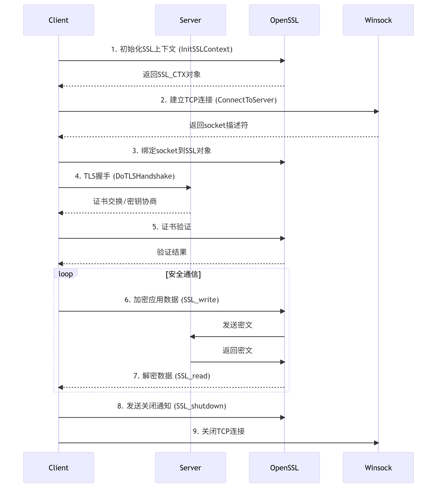
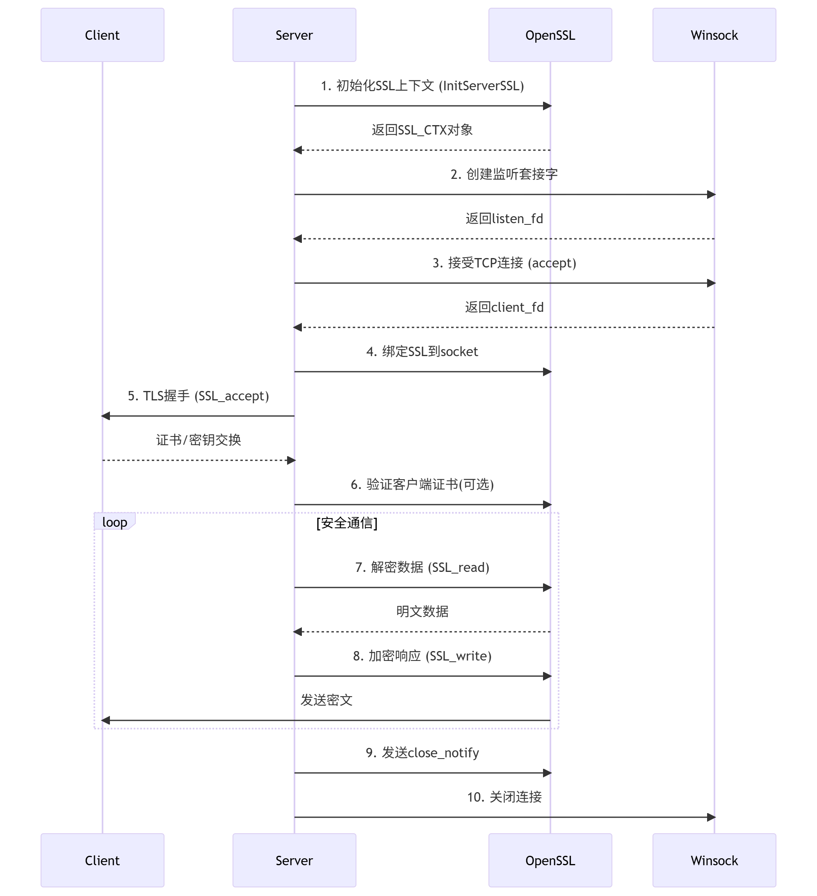
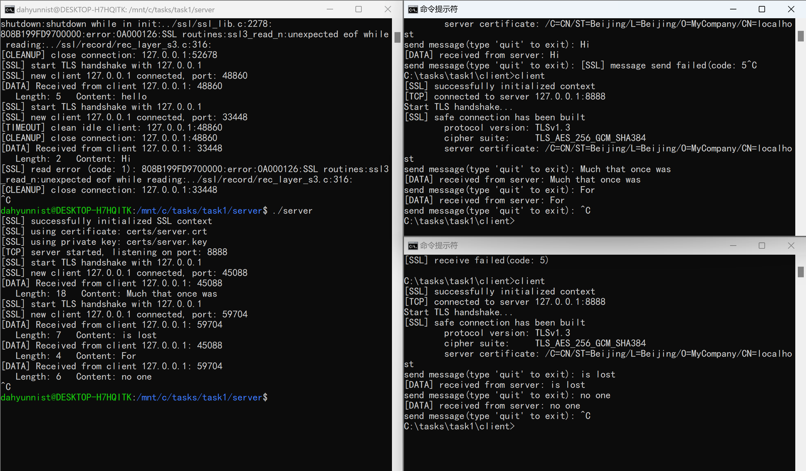
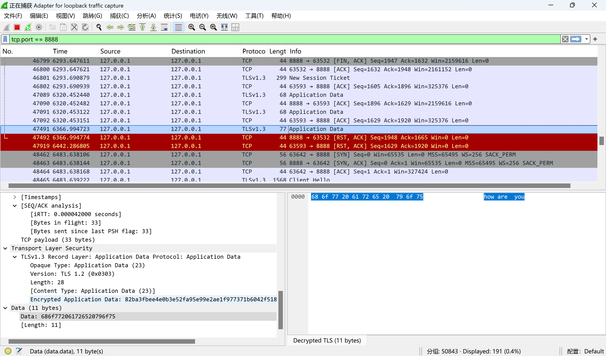
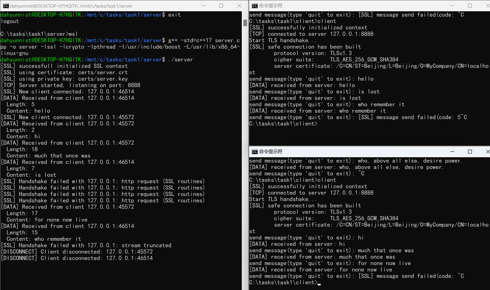

### 2025/7/1 Tue
1. 入职
2. 新电脑环境配置（VScode上的C/C++环境没有搭好）到下午
3. 下午在Windows上实现了最基础的客户端和服务端（服务端原样返回客户端发送的数据）（C:/tasks/task1）
4. 实现了服务端在WSL上运行
### 2025/7/2 Wed
1. 完善了VScode上的C/C++环境配置
2. 实现了通过select模型进行多客户端连接与交互
3. 下午换了新电脑，重新配置环境（配置WSL环境花了很长时间）
4. 开始学习TLS，完成了OpenSSL的下载安装，服务端和客户端安全证书的配置以及server的大部分TLS改造
### 2025/7/3 Thu
1. 完成了server和client的TLS改造

2. 实现了WireShark抓包

### 2025/7/4 Fri
1. 完成了Windows和WSL上Boost库的安装
2. 使用Boost库对server程序进行了重构

