> UCB CS 168：Introduction to the Internet: Architecture and Protocols
# Lecture 1: Intro 1, Layers of the Internet
> The Internet is built with layers of abstraction
> Headers are added as the packet moves down the stack, and unwrapped as the packet moves up the stack
> Hosts parse headers for Layers 1-7
> Routers parse headers for Layers 1-3
## Introduction to the Internet:
1. Internet:
   - federated system
   - operates at enormour scale
   - constantly evolving
   - has a tremendous range and diversity of users and devices
   - operates asynchronously
   - must handle failures at scale 
   - no theoretical model of performance benchmark

2. RFC: Request For Comments
   - many standards are published as RFC documents that are eventually widely accpted
   - RFC documents are numberes sometimes protocols are referred to by their RFC number. For example, TCP/IP protocol is RFC 793.

## Layers of the Internet
### Layer 1: Physical Layer(postman)
1. physical technology to move bits across space:
   - voltages on electrical wire
   - light signals on optical fiber
   - wireless radio waves
### Layer 2: Link Layer
1. Forming a local network:
   - use physical technology to create a link between machines
   - use links to connect all machines in a local area
   - machines can exchange **packets**(a group of bits representing a message) 
### Layer 3: Internet Layer
1. Connecting local networks: instead of directly connecting houses in different areas(cost a lot of links), **introduce a post office in each area and just connect post offices**: 
2. Internet is a **network of networks**: 

3. Hosts vs Switches:
   - **End hosts** —— houses: machines communicating over the internet(**circle** in the picture above), e.g., laptops, servers, etc.
   - **Switches(Routers)** —— post offices: receive packets and forward them toward their destination(**cube** in the picture above)
   
### Layers of Abstraction:

1. Modularity: each layer relies on services from the layer below, and provides services to the layer above.
2. A packet can take multiple hops to reach its destination: 
   - each router needs to forward the packet closer to its destination.
   - each local network along the way could use a different Layer2 protocol
3. Layer 3 offers a **best-effort** service model:
   - Packets are limited in size
   - Packets may be lost, reordered(e.g. split into halves), corrupted(e.g. data inside become incorrect), etc.
   - The network will try its best to deliver your packet, but **no guarantees** —— forces us to build layer 4-7
   - The network won't tell you if the delivery failed
### Layer 4: Transport Layer

1. Function: **Reliably deliver packets, forming connections**
2. On top of global connectivity supported by Layer 1-3:
   - Adds extra mechanisms(e.g. re-sending lost packets) for reliable packet delivery
   - Splits up large data into packets to send them, and reassembles received packets
   - Instead of individual packets, use a mindset of **flows**(aka connections): **A stream of packets** exchanged between two endpoints
> Layer 5 and 6 are now obsolete
### Layer 7: Application Layer
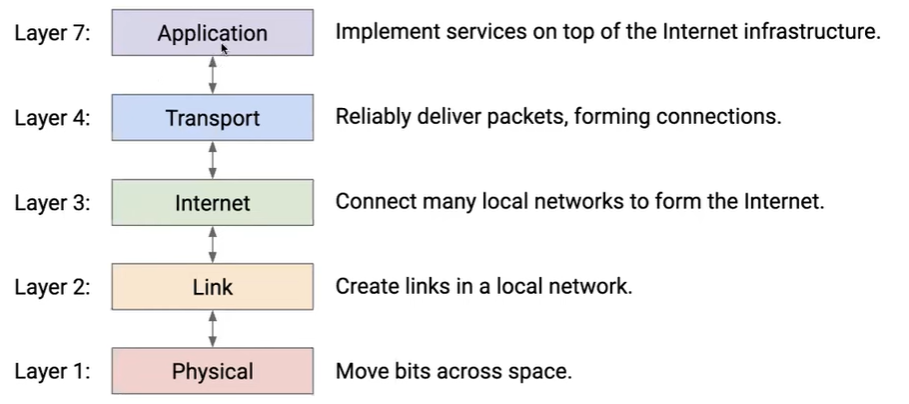
1. Build different services, all on the same infrastructure

## Headers
### Why need headers
1. A packet needs some extra **metadata** to tell u swhat to do with the packet.
   - Analogy: Letter needs to be put in an **envelope**, and the envelope tells the post office what to do with the letter.
2. Metadata about the packet is called **headers**, and the actual data in the packet is called the **payload**
### Postal Analogy
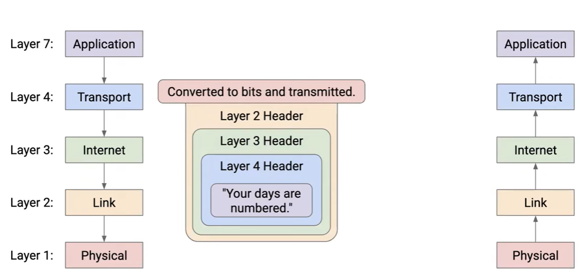
1. Wrap and Unwrap:
   - sending a packet: as the packet passes down, each layer wraps the packet up with its own header.
   - receiving a packet: as the packet passes up, each layer peel off headers, revealing the innner headers and pass it up until the application layer gets the payload.
2. Each layer only cares about the headers at their own layer, and in fact, talks to its equivalent layer on the other side of the commnuication.
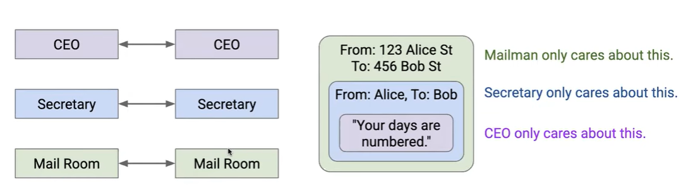
3. Different layers use different addressing schemes
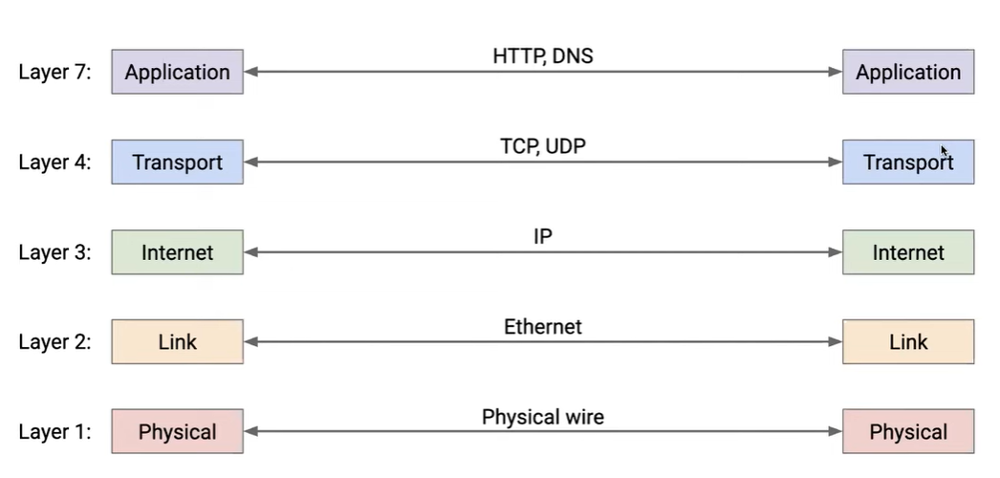
4. Multiple Hops: Each intermediate post office unwraps the outermost most layer, and wraps it up with a new layer and sends it to the nearby post office that is closer to the destination. 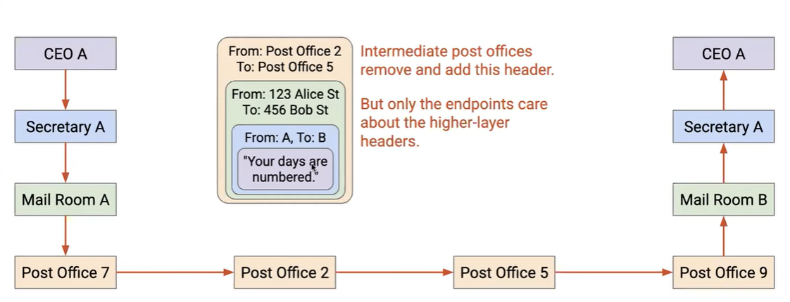
   - each addressing scheme only makes sense to the protocol at that layer 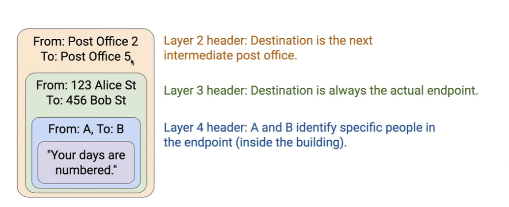
### Implementing Layers at Routers and End Hosts
1. End hosts implement all the layers: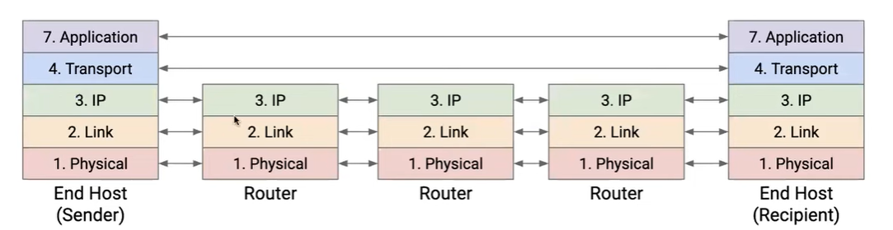 
   - must take message, and wrap headers all the way down to bits on the wire
2. Routers only implement Layers 1-3: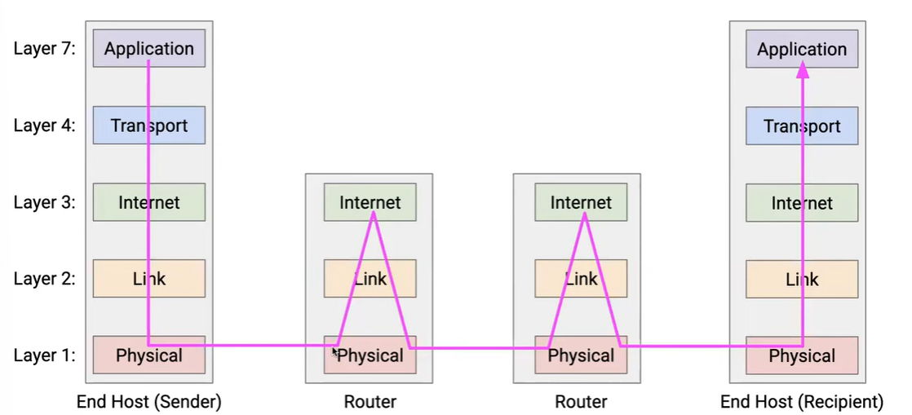
   - must parse the packet(Layer 1, 2) to reveal Layer 3 header, which contains the final destination, and decides where to forward to the next router for global delivery
   - Routers don't support reliable delivery(Layer 4)
   - Routers don't care about the application data(Layer 7)
  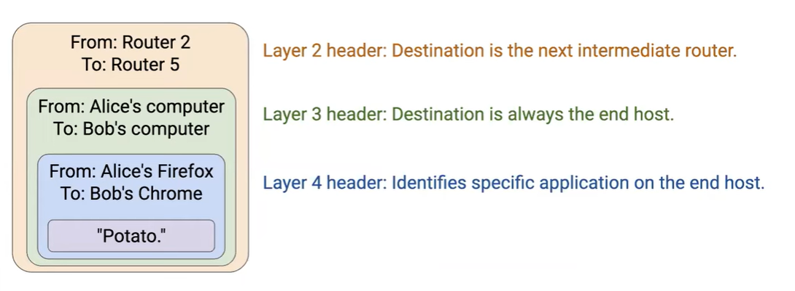
   - unwraps Layer 2 header and adds a new Layer 2 header for the next hop 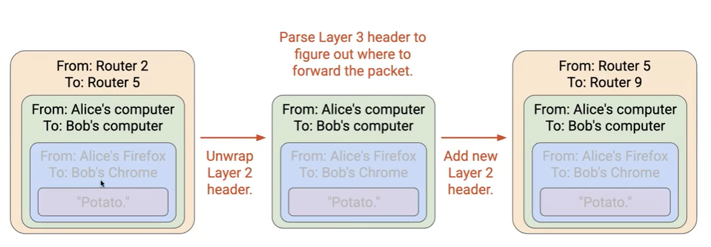
   - Each hop could use a different Layer 2 protocol: 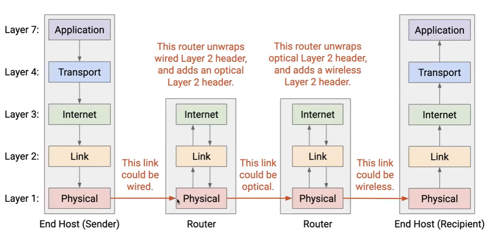

# Lecture 2: Intro 2, Internet Design
## Internet Design Principles
### Architecting the Internet

### Narrow Waist, Demultiplexing

### End-to-End Principle

## Designing Resource Sharing
### Statistical Multiplexing

### Circuit vs. Packet Switching

### Which is Better?

### A Brief History

