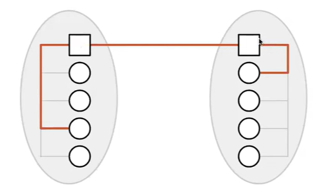
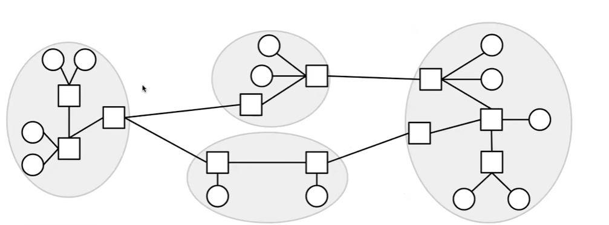
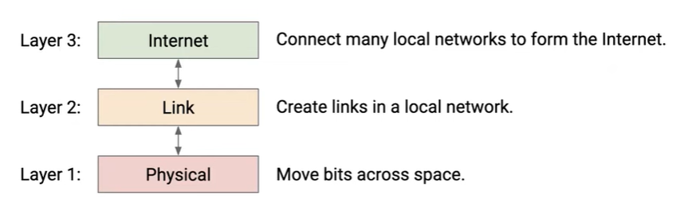
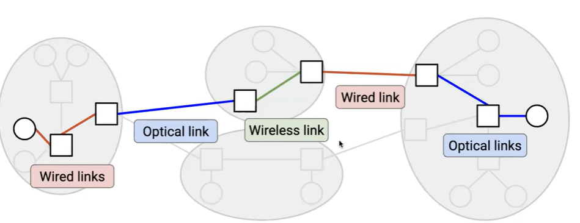
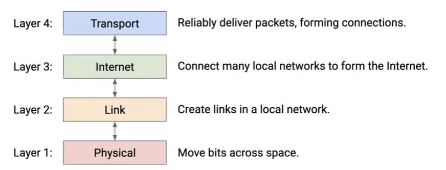

1. 计算机网络：工作要求与完整学习
2. LLM：入门学习
3. python：要精通
4. 算法：CS自学与leetcode刷题
5. 韩语：
6. 读书：每天至少10页纸质书

# UCB CS 168：Introduction to the Internet: Architecture and Protocols
## Introduction
### Introduction to the Interner:
1. Internet:
   - federated system
   - operates at enormour scale
   - constantly evolving
   - has a tremendous range and diversity of users and devices
   - operates asynchronously
   - must handle failures at scale 
   - no theoretical model of performance benchmark

2. RFC: Request For Comments
   - many standards are published as RFC documents that are eventually widely accpted
   - RFC documents are numberes sometimes protocols are referred to by their RFC number. For example, TCP/IP protocol is RFC 793.

### Layers of the Internet
#### Layer 1: Physical Layer(postman)
1. physical technology to move bits across space"
   - voltages on electrical wire
   - light signals on optical fiber
   - wireless radio waves
#### Layer 2: Link Layer
1. Forming a local network:
   - use physical technology to create a link between machines
   - use links to connect all machines in a local area
   - machines can exchange **packets**(a group of bits representing a message) 
#### Layer 3: Internet Layer
1. Connecting local networks: instead of directly connecting houses in different areas(cost a lot of links), **introduce a post office in each area and just connect post offices**: 
2. Internet is a **network of networks**: 

3. Hosts vs Switches:
   - **End hosts** —— houses: machines communicating over the internet(**circle** in the picture above), e.g., laptops, servers, etc.
   - **Switches(Routers)** —— post offices: receive packets and forward them toward their destination(**cube** in the picture above)
   
#### Layers of Abstraction:

1. Modularity: each layer relies on services from the layer below, and provides services to the layer above.
2. A packet can take multiple hops to reach its destination: 
   - each router needs to forward the packet closer to its destination.
   - each local network along the way could use a different Layer2 protocol
3. Layer 3 offers a **best-effort** service model:
   - Packets are limited in size
   - Packets may be lost, reordered(e.g. split into halves), corrupted(e.g. data inside become incorrect), etc.
   - The network will try its best to deliver your packet, but **no guarantees** —— forces us to build layer 4-7
   - The network won't tell you if the delivery failed
#### Layer 4: Transport Layer

1. On top of global connectivity supported by Layer 1-3:
   - Adds extra mechanisms(e.g. re-sending lost packets) for reliable packet delivery
   - Splits up large data into packets to send them, and reassembles received packets
   - Instead of individual packets, use a mindset of **flows**(aka connections): **A stream of packets** exchanged between two endpoints
> Layer 5 and 6 are now obsolete
#### Layer 7: Application Layer
1. Build different services, all on the same infrastructure